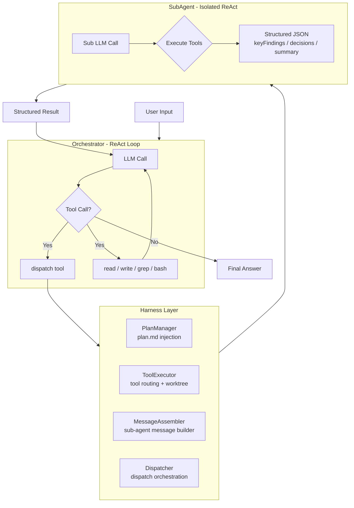

# Relay Code

<div align="center">

**A single-agent coding assistant with ReAct-driven semantic orchestration**

[](LICENSE)
[](https://www.typescriptlang.org/)
[](https://bun.sh)
[](https://github.com/evenli0/Relay-Code/actions/workflows/ci.yml)

[English](README.md) | [中文](README.zh-CN.md)

</div>

---

Relay Code is a **single-agent coding assistant** that uses ReAct loops and semantic orchestration to coordinate sub-agents. Unlike rigid workflow scripts, Relay Code writes a **plan file** and dynamically dispatches sub-agents based on the plan's phases, enabling adaptive task decomposition.

---

## Architecture



### Component Breakdown

| Component | File | Responsibility |
|---|---|---|
| **Orchestrator** | `src/orchestrator.ts` | Main ReAct loop, plan injection, tool dispatch |
| **PlanManager** | `src/plan-manager.ts` | Reads and injects plan.md into context |
| **ToolExecutor** | `src/tool-executor.ts` | Routes tool calls, resolves worktree paths |
| **MessageAssembler** | `src/message-assembler.ts` | Builds sub-agent chat messages from config |
| **Dispatcher** | `src/dispatcher.ts` | Creates sub-agents and runs the orchestration |
| **SubAgent** | `src/dispatcher.ts` | One-shot ReAct executor with isolated context |
| **Tool Definitions** | `src/tools.ts` | read, write, grep, bash, dispatch |
| **LLM Client** | `src/llm.ts` | DeepSeek API wrapper with timeout and error handling |

---

## Quick Start

### Prerequisites

- **Bun** 1.3+ ([install](https://bun.sh))
- **DeepSeek API key** — [get one here](https://platform.deepseek.com)

### Setup

```bash
git clone https://github.com/evenli0/Relay-Code.git
cd relay-code
bun install
```

### Configuration

```bash
export DEEPSEEK_API_KEY="sk-..."
export DEEPSEEK_MODEL="deepseek-v4-flash"   # Optional (default)
```

### Usage

```bash
# Run the agent with a task
bun run src/index.ts "analyze the file structure of this project"

# Development mode (watch mode)
bun run dev
```

### Examples

```bash
# Single task
bun run src/index.ts "find all functions that handle error logging"

# Workflow orchestration (creates plan.md automatically)
bun run src/index.ts "evaluate the code quality of this project using a multi-agent workflow"
```

### Testing

```bash
bun test                          # Unit tests (43 tests)
bun test tests/integration/       # Integration tests (git worktrees)
bun run type-check                # TypeScript type checking
```

---

## Key Features

### 🧩 Plan-Driven Workflow

Write a `plan.md` — the harness automatically injects it into context, guiding the agent through structured phases:

```markdown
# Plan: Security Audit
## Phases
1. [ ] Phase 1 — Parallel scan (3 sub-agents)
2. [ ] Phase 2 — Synthesize findings
```

### 🔀 Parallel Dispatch

Dispatch multiple sub-agents in a single ReAct turn, each with isolated context:

```typescript
dispatch({
  prompt: {
    role: "security auditor",
    task: "analyze src/ for injection vulnerabilities",
    instructions: "Focus on input validation and type safety"
  },
  responseSchema: {
    type: "object",
    properties: {
      score: { type: "number" },
      findings: { type: "array" }
    }
  }
})
```

### 🛡️ Worktree Isolation

Sub-agents can run in isolated git worktrees, enabling safe parallel file writes:

```typescript
dispatch({
  isolation: "worktree",
  prompt: { task: "refactor multiple files" }
})
```

### 📊 Structured Results

Every sub-agent returns structured JSON with standard fields:

```json
{
  "keyFindings": ["X vulnerability found in auth module"],
  "decisions": ["refactor auth middleware"],
  "summary": "Auth module requires immediate attention — score: 4/10"
}
```

---

## Project Structure

```
relay-code/
├── src/
│   ├── index.ts              # Entry point
│   ├── orchestrator.ts       # Main ReAct loop
│   ├── harness.ts            # Facade — combines all components
│   ├── plan-manager.ts       # Plan injection
│   ├── message-assembler.ts  # Sub-agent message builder
│   ├── tool-executor.ts      # Tool routing + worktree isolation
│   ├── dispatcher.ts         # Dispatch + SubAgent
│   ├── tools.ts              # Tool definitions
│   ├── llm.ts                # DeepSeek API client
│   ├── types.ts              # Type definitions
│   ├── memory.ts             # Dialogue persistence
│   ├── prompts.ts            # System prompt builder
│   └── worktree.ts           # Git worktree management
├── tests/
│   ├── harness.test.ts       # Harness + dispatch tests
│   ├── react.test.ts         # ReAct loop tests
│   ├── memory.test.ts        # Memory tests
│   ├── tools.test.ts         # Tool function tests
│   ├── helpers/              # Test sandbox utilities
│   └── integration/          # Real git worktree tests
├── .github/workflows/ci.yml  # CI pipeline
├── biome.json                # Lint / format configuration
├── CHANGELOG.md
├── LICENSE
└── README.md
```

---

## Environment Variables

| Variable | Required | Default | Description |
|---|---|---|---|
| `DEEPSEEK_API_KEY` | ✅ | — | DeepSeek API key |
| `DEEPSEEK_MODEL` | ❌ | `deepseek-v4-flash` | Model name |
| `DEEPSEEK_BASE_URL` | ❌ | `https://api.deepseek.com` | API base URL |

---

## Why Relay Code?

| Approach | Flexibility | Reliability | Setup Cost |
|---|---|---|---|
| **Relay Code** (plan + dispatch) | High — dynamic plan adjustment | Medium — LLM-driven | Low — one prompt |
| **Claude Code Workflow** (JS script) | Low — fixed script | High — deterministic | High — JS boilerplate |
| **Manual ReAct** | High — anything goes | Low — no structure | None |

Relay Code strikes a balance: use a plan as a lightweight script, let the LLM adjust it dynamically when things go wrong.

---

## License

[MIT](LICENSE)

---

## Status


