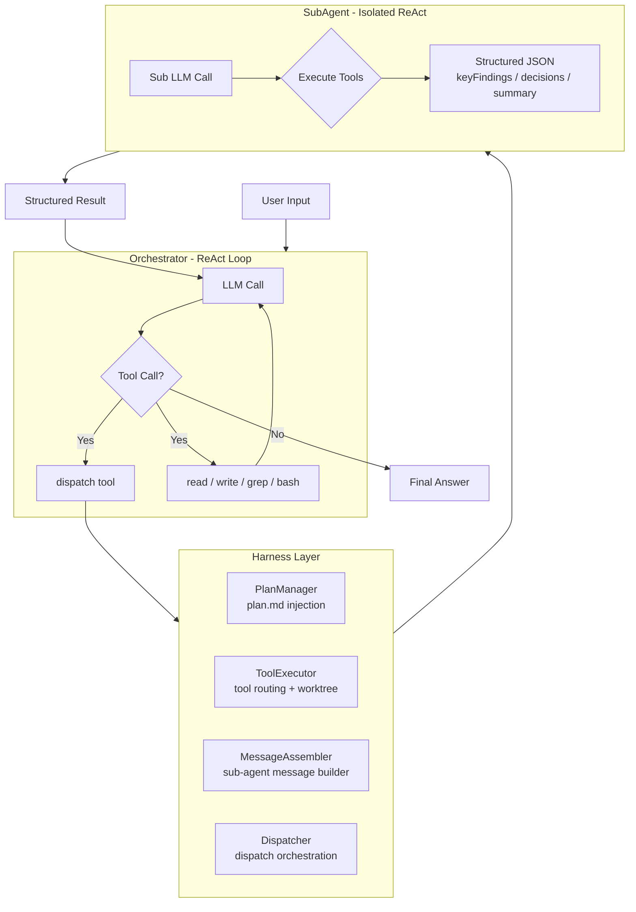

# Relay Code

<div align="center">

**A single-agent coding assistant with ReAct-driven semantic orchestration**

[](LICENSE)
[](https://github.com/evenli0/Relay-Code/actions/workflows/ci.yml)
[](https://github.com/evenli0/Relay-Code/actions/workflows/ci.yml)
[](https://www.typescriptlang.org/)
[](https://bun.sh)
[](https://github.com/evenli0/Relay-Code/actions)
[](https://github.com/evenli0/Relay-Code)

[English](README.md) | [中文](README.zh-CN.md)

</div>

Relay Code is an open-source, model-agnostic CLI coding agent that orchestrates sub-agents through ReAct loops and dynamic plan files. Unlike rigid workflow scripts, Relay Code writes a `plan.md` at runtime and dispatches sub-agents adaptively — striking a balance between flexibility and reliability.

Built with **TypeScript** (strict mode), powered by **Bun**, and provider-agnostic by design.

---

## Architecture



### Component Breakdown

| Component | File | Responsibility |
|---|---|---|
| **Orchestrator** | `src/orchestrator.ts` | Main ReAct loop, plan injection, tool dispatch |
| **Harness** | `src/harness.ts` | Facade combining PlanManager + ToolExecutor + Dispatcher |
| **PlanManager** | `src/plan-manager.ts` | Reads plan.md and injects into LLM context |
| **ToolExecutor** | `src/tool-executor.ts` | Routes tool calls, resolves worktree paths |
| **Dispatcher** | `src/dispatcher.ts` | Creates and manages SubAgent lifecycle |
| **SubAgent** | `src/dispatcher.ts` | Isolated ReAct executor with structured output |
| **MessageAssembler** | `src/message-assembler.ts` | Builds sub-agent messages from dispatch config |
| **Tools** | `src/tools.ts` | Tool definitions — read, write, grep, bash, dispatch |
| **LLM Client** | `src/llm.ts` | DeepSeek/OpenAI-compatible API wrapper |
| **Errors** | `src/errors.ts` | Unified error handling (unwrapError) |

---

## Quick Start

### Prerequisites

- [Bun](https://bun.sh) 1.3+
- DeepSeek API key — [get one free](https://platform.deepseek.com)

### Setup

```bash
git clone https://github.com/evenli0/Relay-Code.git
cd relay-code
bun install
export DEEPSEEK_API_KEY="sk-..."
```

### Usage

```bash
# Quick analysis
bun run src/index.ts "analyze the file structure of this project"

# Multi-agent workflow
bun run src/index.ts "evaluate the code quality of this project using a multi-agent workflow"

# Development mode (auto-reload)
bun run dev
```

### Testing

```bash
bun test                    # Unit tests — 43 tests, 0 failures
bun run test:integration    # Integration tests (git worktrees)
bun run type-check          # TypeScript strict type checking
bun run test:coverage       # Test coverage report
```

---

## Key Features

### 🧩 Plan-Driven Workflow

Write a lightweight `plan.md` — the harness auto-injects it into context. The agent follows the plan's phases and uses `dispatch` to parallelize work.

```markdown
# Plan: Security Audit
## Phases
1. [ ] Phase 1 — Parallel scan (3 sub-agents)
2. [ ] Phase 2 — Synthesize findings
```

### 🔀 Parallel Dispatch

Spin up multiple sub-agents in a single ReAct turn. Each runs in its own context:

```typescript
dispatch({
  prompt: {
    role: "security auditor",
    task: "analyze src/ for injection vulnerabilities",
    instructions: "Focus on input validation and type safety"
  },
  responseSchema: {
    type: "object",
    properties: {
      score: { type: "number" },
      findings: { type: "array" }
    }
  }
})
```

### 🛡️ Worktree Isolation

Sub-agents can run in isolated git worktrees — safe parallel file modification with zero conflicts:

```typescript
dispatch({
  isolation: "worktree",
  prompt: { task: "refactor multiple files across the project" }
})
```

### 📊 Structured Results

Every sub-agent returns structured JSON, not loose text:

```json
{
  "keyFindings": ["Injection vulnerability in auth module"],
  "decisions": ["Rewrite input sanitization"],
  "summary": "Auth module: score 4/10 — immediate action required"
}
```

---

## Why Relay Code?

| Dimension | Relay Code | Claude Code Workflow | Manual ReAct |
|---|---|---|---|
| **Flexibility** | High — plan adjusts dynamically | Low — script is fixed | High — no constraints |
| **Reliability** | Medium — LLM-guided execution | High — deterministic | Low — no structure |
| **Setup cost** | Low — one prompt | High — JS boilerplate | None |
| **Parallelism** | Built-in dispatch | Agent tool | Manual |
| **Sub-agent isolation** | Git worktree support | Worktree isolation | None |
| **Result structure** | JSON schema enforced | Free-form text | Free-form text |

Relay Code is designed for developers who want structured, auditable AI assistance without being locked into a specific LLM provider or IDE.

---

## Project Health

| Badge | Status |
|---|---|
| **CI** | [](https://github.com/evenli0/Relay-Code/actions/workflows/ci.yml) |
| **CodeQL** | [](https://github.com/evenli0/Relay-Code/actions/workflows/ci.yml) |
| **Dependencies** | [](.github/dependabot.yml) |
| **Lint** | Biome (strict) |
| **TypeScript** | Strict mode with noUncheckedIndexedAccess |
| **Pre-commit** | Husky + lint-staged (Biome check) |

---

## Project Structure

```
relay-code/
├── src/
│   ├── index.ts              # Entry point
│   ├── orchestrator.ts       # Main ReAct loop
│   ├── harness.ts            # Facade — combines all components
│   ├── plan-manager.ts       # Plan injection
│   ├── message-assembler.ts  # Sub-agent message builder
│   ├── tool-executor.ts      # Tool routing + worktree isolation
│   ├── dispatcher.ts         # Dispatch + SubAgent
│   ├── react-loop.ts         # Shared ReAct loop utilities
│   ├── tools.ts              # Tool definitions
│   ├── llm.ts                # DeepSeek/OpenAI API client
│   ├── types.ts              # Type definitions
│   ├── memory.ts             # Dialogue persistence
│   ├── errors.ts             # Unified error handling
│   ├── prompts.ts            # System prompt builder
│   └── worktree.ts           # Git worktree management
├── tests/                    # 43 unit tests
│   ├── harness.test.ts
│   ├── react.test.ts
│   ├── memory.test.ts
│   ├── tools.test.ts
│   ├── helpers/
│   └── integration/
├── .github/
│   ├── workflows/ci.yml      # CI with CodeQL
│   ├── dependabot.yml        # Auto dependency updates
│   ├── ISSUE_TEMPLATE/
│   └── PULL_REQUEST_TEMPLATE.md
├── biome.json                # Lint / format config
├── CHANGELOG.md              # Keep a Changelog
├── CONTRIBUTING.md           # Contribution guide
├── CODE_OF_CONDUCT.md
├── SECURITY.md
├── ROADMAP.md                # Project roadmap
├── LICENSE (MIT)
└── README.md
```

---

## Contributing

We welcome contributions! See [CONTRIBUTING.md](CONTRIBUTING.md) for guidelines, [CODE_OF_CONDUCT.md](CODE_OF_CONDUCT.md) for community standards, and [ROADMAP.md](ROADMAP.md) for upcoming plans.

---

## Environment Variables

| Variable | Required | Default | Description |
|---|---|---|---|
| `DEEPSEEK_API_KEY` | ✅ | — | DeepSeek API key |
| `DEEPSEEK_MODEL` | ❌ | `deepseek-v4-flash` | Model name |
| `DEEPSEEK_BASE_URL` | ❌ | `https://api.deepseek.com` | API base URL |

---

## License

[MIT](LICENSE) — free for personal and commercial use.
