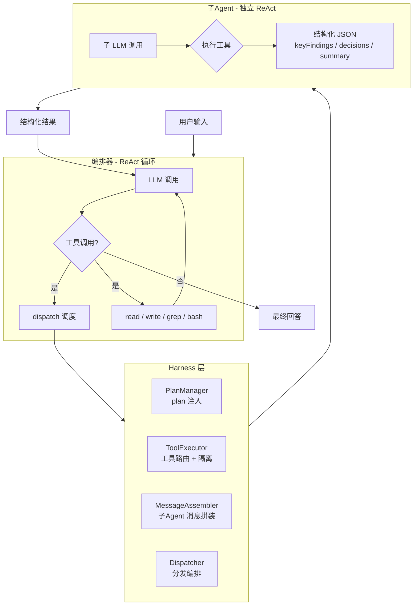

# Relay Code

<div align="center">

**一个基于 ReAct 语义编排的单 Agent 编码助手——开源、多模型、CLI 原生**

[](LICENSE)
[](https://github.com/evenli0/Relay-Code/actions/workflows/ci.yml)
[](https://github.com/evenli0/Relay-Code/actions/workflows/ci.yml)
[](https://www.typescriptlang.org/)
[](https://bun.sh)
[](https://github.com/evenli0/Relay-Code/actions)

[English](README.md) | [中文](README.zh-CN.md)

</div>

Relay Code 是一个**开源、多模型兼容的 CLI 编码助手**，通过 ReAct 循环 + `dispatch` 工具实现语义化的工作流编排。与 Workflow 的死板 JS 脚本不同，Relay Code 让 LLM 自主编写 plan 并动态调度子 Agent。

基于 **TypeScript**（严格模式），运行在 **Bun** 上，不绑定任何特定 LLM 厂商。

---

## 架构



### 核心组件

| 组件 | 文件 | 职责 |
|---|---|---|
| **Orchestrator** | `src/orchestrator.ts` | 主 ReAct 循环、plan 注入、工具调度 |
| **Harness** | `src/harness.ts` | 外观层，组合 PlanManager + ToolExecutor + Dispatcher |
| **PlanManager** | `src/plan-manager.ts` | 读取 plan.md 并注入 LLM 上下文 |
| **ToolExecutor** | `src/tool-executor.ts` | 工具调用路由、worktree 路径隔离 |
| **Dispatcher** | `src/dispatcher.ts` | 创建和管理子 Agent 生命周期 |
| **SubAgent** | `src/dispatcher.ts` | 独立 ReAct 执行器，返回结构化输出 |
| **MessageAssembler** | `src/message-assembler.ts` | 根据 dispatch 配置构建子 Agent 消息 |
| **Tools** | `src/tools.ts` | 工具定义 — read / write / grep / bash / dispatch |
| **LLM 客户端** | `src/llm.ts` | DeepSeek/OpenAI 兼容 API 封装 |
| **Errors** | `src/errors.ts` | 统一错误处理工具 |

---

## 快速开始

### 前置条件

- [Bun](https://bun.sh) 1.3+
- DeepSeek API key（[免费申请](https://platform.deepseek.com)）

### 安装

```bash
git clone https://github.com/evenli0/Relay-Code.git
cd relay-code
bun install
export DEEPSEEK_API_KEY="sk-..."
```

### 使用

```bash
# 快速分析
bun run src/index.ts "分析当前项目的文件结构"

# 多 Agent 工作流
bun run src/index.ts "用多 Agent 工作流评估这个项目的代码质量"

# 开发模式（文件变更自动重启）
bun run dev
```

### 测试

```bash
bun test                    # 单元测试 — 43 个，全部通过
bun run test:integration    # 集成测试（git worktree）
bun run type-check          # TypeScript 严格模式类型检查
bun run test:coverage       # 测试覆盖率报告
```

---

## 核心特性

### 🧩 Plan 驱动的工作流

编写 `plan.md`，harness 自动注入上下文，引导 Agent 按阶段执行。

```markdown
# Plan: 安全审计
## 阶段
1. [ ] Phase 1 — 并行扫描（3 个子 Agent）
2. [ ] Phase 2 — 汇总发现
```

### 🔀 并行调度

单轮 ReAct 中派发多个子 Agent，每个拥有独立上下文：

```typescript
dispatch({
  prompt: {
    role: "安全审计员",
    task: "分析 src/ 中的注入漏洞",
    instructions: "关注输入校验和类型安全"
  },
  responseSchema: {
    type: "object",
    properties: {
      score: { type: "number" },
      findings: { type: "array" }
    }
  }
})
```

### 🛡️ Worktree 隔离

子 Agent 可在独立 git worktree 中执行，并行写文件零冲突：

```typescript
dispatch({
  isolation: "worktree",
  prompt: { task: "跨文件重构" }
})
```

### 📊 结构化结果

每个子 Agent 返回结构化 JSON，非松散文本：

```json
{
  "keyFindings": ["认证模块存在注入漏洞"],
  "decisions": ["重写输入过滤逻辑"],
  "summary": "认证模块评分 4/10 — 需立即处理"
}
```

---

## 为什么选择 Relay Code？

| 维度 | Relay Code | Claude Code Workflow | 纯 ReAct |
|---|---|---|---|
| **灵活性** | 高 — plan 动态调整 | 低 — 脚本固定 | 高 — 无约束 |
| **可靠性** | 中 — LLM 引导执行 | 高 — 确定执行 | 低 — 无结构 |
| **启动成本** | 低 — 一个 prompt | 高 — JS 模板代码 | 无 |
| **并行能力** | 内置 dispatch | Agent 工具 | 手动 |
| **子 Agent 隔离** | Git worktree | Worktree 隔离 | 无 |
| **结果格式** | JSON Schema 控制 | 自由文本 | 自由文本 |

Relay Code 面向希望获得结构化、可审计的 AI 辅助，同时不希望绑定特定 LLM 供应商或 IDE 的开发者。

---

## 项目健康状态

| 指标 | 状态 |
|---|---|
| **CI** | [](https://github.com/evenli0/Relay-Code/actions/workflows/ci.yml) |
| **CodeQL** | [](https://github.com/evenli0/Relay-Code/actions/workflows/ci.yml) |
| **依赖管理** | Dependabot 周度更新 |
| **代码检查** | Biome（严格） |
| **TypeScript** | 严格模式 + noUncheckedIndexedAccess |
| **Pre-commit** | Husky + lint-staged（Biome 检查） |

---

## 项目结构

```
relay-code/
├── src/
│   ├── index.ts              # 入口
│   ├── orchestrator.ts       # 主 ReAct 循环
│   ├── harness.ts            # 外观层
│   ├── plan-manager.ts       # Plan 注入
│   ├── message-assembler.ts  # 子 Agent 消息拼装
│   ├── tool-executor.ts      # 工具路由 + 隔离
│   ├── dispatcher.ts         # 分发 + 子 Agent
│   ├── react-loop.ts         # 共享 ReAct 工具函数
│   ├── tools.ts              # 工具定义
│   ├── llm.ts                # LLM API 客户端
│   ├── types.ts              # 类型定义
│   ├── memory.ts             # 对话持久化
│   ├── errors.ts             # 统一错误处理
│   ├── prompts.ts            # 系统提示词构建
│   └── worktree.ts           # Git worktree 管理
├── tests/                    # 43 个单元测试
├── .github/
│   ├── workflows/ci.yml      # CI + CodeQL
│   ├── dependabot.yml        # 自动依赖更新
│   ├── ISSUE_TEMPLATE/
│   └── PULL_REQUEST_TEMPLATE.md
├── CHANGELOG.md
├── CONTRIBUTING.md
├── CODE_OF_CONDUCT.md
├── SECURITY.md
├── ROADMAP.md
├── LICENSE (MIT)
└── README.md
```

---

## 贡献指南

欢迎贡献！请阅读 [CONTRIBUTING.md](CONTRIBUTING.md) 了解开发流程，[CODE_OF_CONDUCT.md](CODE_OF_CONDUCT.md) 了解社区准则，[ROADMAP.md](ROADMAP.md) 了解项目规划。

---

## 环境变量

| 变量 | 必填 | 默认值 | 说明 |
|---|---|---|---|
| `DEEPSEEK_API_KEY` | ✅ | — | DeepSeek API 密钥 |
| `DEEPSEEK_MODEL` | ❌ | `deepseek-v4-flash` | 模型名称 |
| `DEEPSEEK_BASE_URL` | ❌ | `https://api.deepseek.com` | API 地址 |

---

## 许可证

[MIT](LICENSE) — 个人和商业使用免费。
