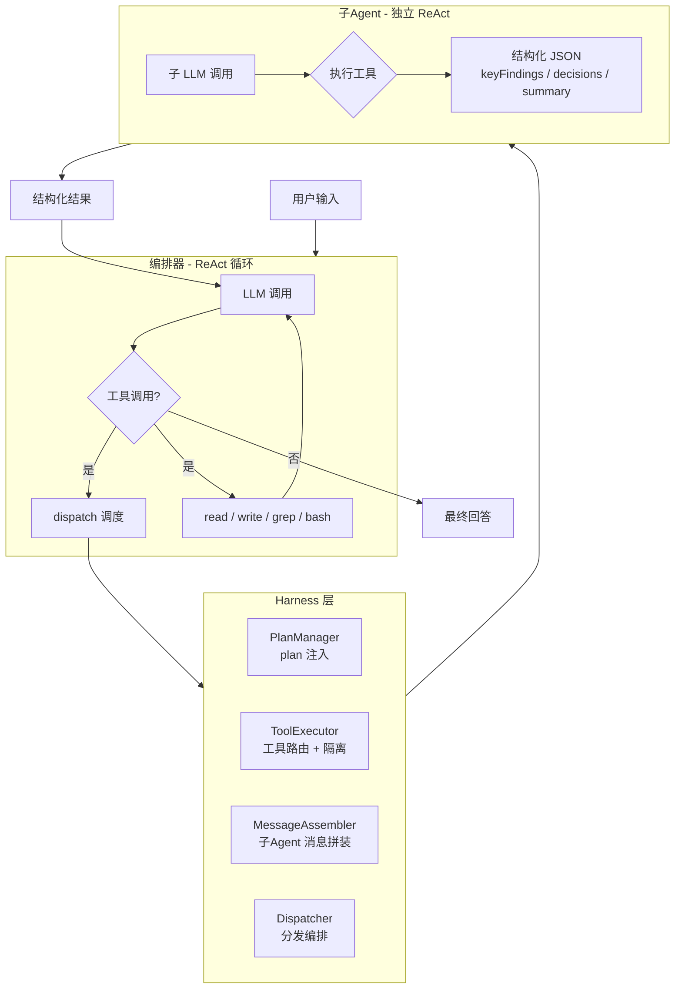

# Relay Code

<div align="center">

**一个基于 ReAct 语义编排的单 Agent 编码助手**

[](LICENSE)
[](https://www.typescriptlang.org/)
[](https://bun.sh)

[English](README.md) | [中文](README.zh-CN.md)

</div>

---

Relay Code 是一个**单 Agent 编码助手系统**，通过 ReAct 循环 + `dispatch` 工具实现语义化的工作流编排。与 Workflow 的死板 JS 脚本不同，Relay Code 让 LLM 自主编写 plan 并动态调度子 Agent，在灵活性和可靠性之间取得平衡。

---

## 架构



### 核心组件

| 组件 | 文件 | 职责 |
|---|---|---|
| **Orchestrator** | `src/orchestrator.ts` | 主 ReAct 循环、plan 注入、工具调度 |
| **PlanManager** | `src/plan-manager.ts` | 读取 plan.md 并注入上下文 |
| **ToolExecutor** | `src/tool-executor.ts` | 工具调用路由、worktree 路径隔离 |
| **MessageAssembler** | `src/message-assembler.ts` | 构建子Agent 的 ChatMessage |
| **Dispatcher** | `src/dispatcher.ts` | 创建子Agent 并执行编排 |
| **SubAgent** | `src/dispatcher.ts` | 一次性 ReAct 执行器，独立上下文 |
| **Tools** | `src/tools.ts` | read / write / grep / bash / dispatch |
| **LLM 客户端** | `src/llm.ts` | DeepSeek API 封装，含超时和错误处理 |

---

## 快速开始

### 前置条件

- **Bun** 1.3+（[安装](https://bun.sh)）
- **DeepSeek API key**（[申请](https://platform.deepseek.com)）

### 安装

```bash
git clone https://github.com/evenli0/Relay-Code.git
cd relay-code
bun install
```

### 配置

```bash
export DEEPSEEK_API_KEY="sk-..."
export DEEPSEEK_MODEL="deepseek-v4-flash"   # 可选（默认值）
```

### 使用

```bash
# 运行 Agent
bun run src/index.ts "分析当前项目的文件结构"

# 开发模式（文件变更自动重启）
bun run dev
```

### 测试

```bash
bun test                          # 单元测试（43 个）
bun test tests/integration/       # 集成测试（git worktree）
bun run type-check                # 类型检查
```

---

## 核心特性

### 🧩 Plan 驱动的工作流

编写 `plan.md`，harness 自动注入上下文，引导 Agent 按阶段执行。

### 🔀 并行调度

单轮 ReAct 中派发多个子 Agent，每个拥有独立上下文。

### 🛡️ Worktree 隔离

子 Agent 可在独立 git worktree 中执行，并行写文件互不干扰。

### 📊 结构化结果

每个子 Agent 返回带有 `keyFindings` / `decisions` / `summary` 的结构化 JSON。

---

## 为什么选择 Relay Code？

| 方案 | 灵活性 | 可靠性 | 启动成本 |
|---|---|---|---|
| **Relay Code**（plan + dispatch） | 高 — 动态调整 plan | 中 — LLM 驱动 | 低 — 一个 prompt |
| **Claude Code Workflow**（JS 脚本） | 低 — 脚本固定 | 高 — 确定执行 | 高 — JS 模板代码 |
| **纯 ReAct** | 高 — 无约束 | 低 — 无结构 | 无 |

Relay Code 在灵活性和可靠性之间取得平衡：用 plan 作为轻量级脚本，让 LLM 在遇到障碍时动态调整。

---

## 项目结构

```
relay-code/
├── src/               # 源代码
├── tests/             # 测试（43 个）
├── docs/              # 文档
├── .github/workflows/ # CI 流水线
├── CHANGELOG.md
├── LICENSE
└── README.md
```

---

## 环境变量

| 变量 | 必填 | 默认值 | 说明 |
|---|---|---|---|
| `DEEPSEEK_API_KEY` | ✅ | — | DeepSeek API 密钥 |
| `DEEPSEEK_MODEL` | ❌ | `deepseek-v4-flash` | 模型名称 |
| `DEEPSEEK_BASE_URL` | ❌ | `https://api.deepseek.com` | API 地址 |

---

## 许可证

[MIT](LICENSE)
