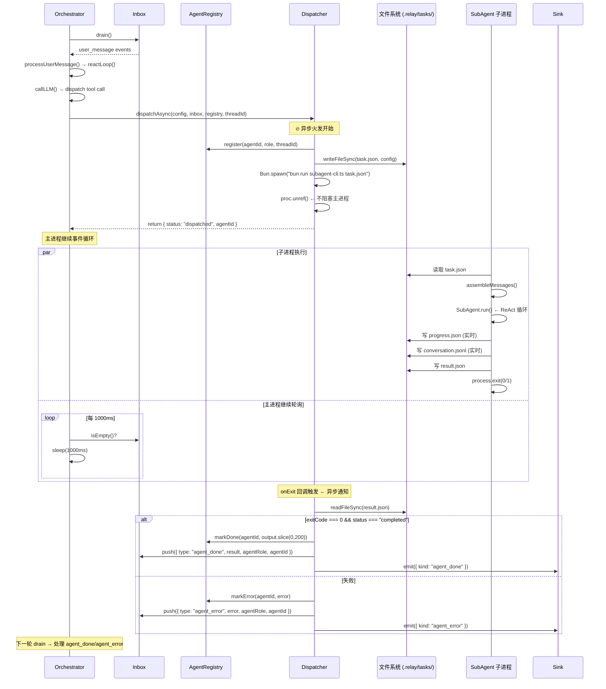
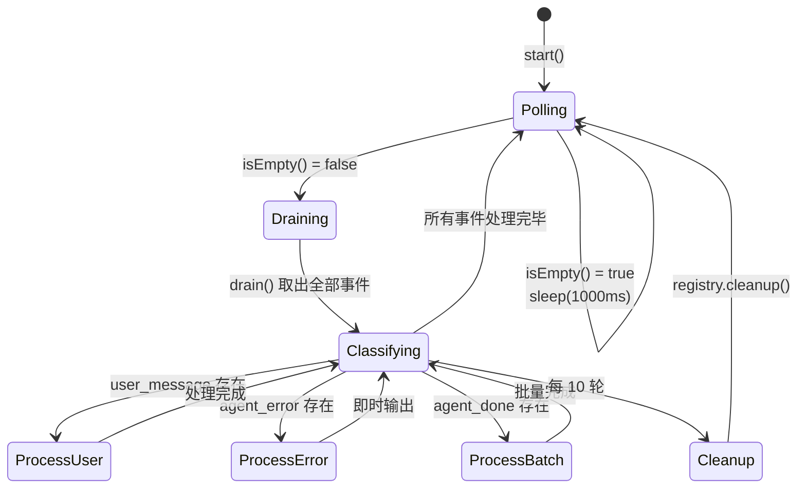
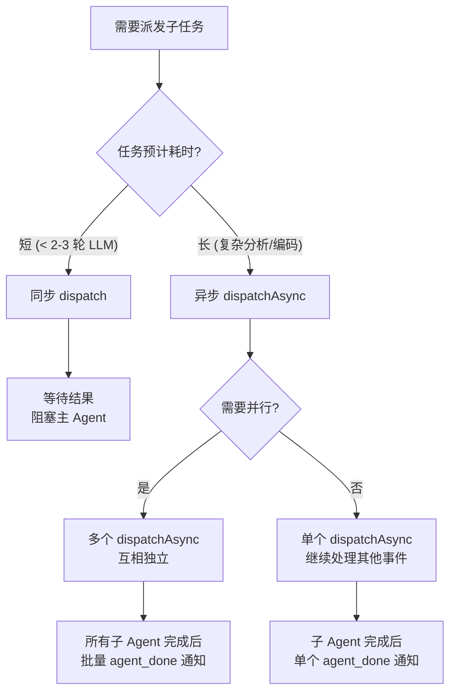
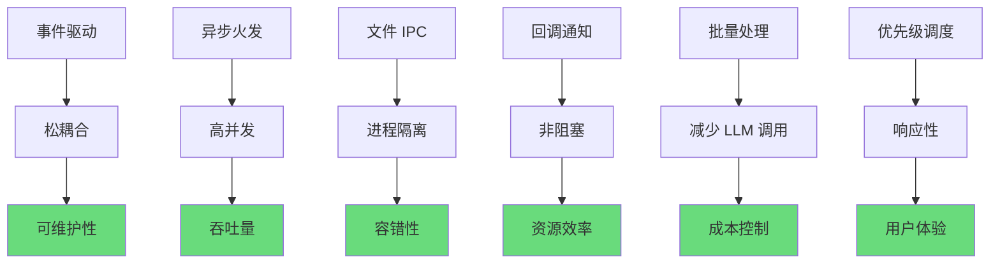
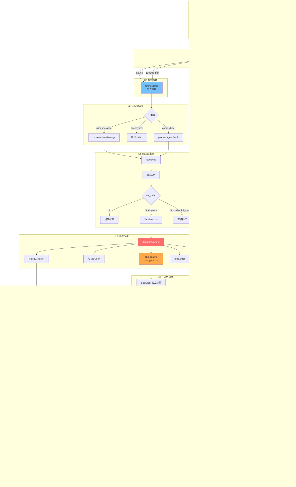

# Relay-Code Daemon 异步架构深度分析

> **分析视角**: 异步系统架构  
> **分析范围**: Inbox 事件队列 → dispatchAsync 火发 → 文件 IPC → onExit 回调 → 事件驱动循环  
> **行号基准**: 基于 commit 时的 `src/` 源文件

---

## 一、异步架构全景图

```mermaid
flowchart TB
    subgraph "用户输入层"
        A[stdin readline] -->|"line 事件"| B
    end

    subgraph "事件驱动核心"
        B[Inbox<br/>事件收件箱] -->|"drain()"| C[Orchestrator<br/>事件循环<br/>(1000ms 轮询)]
    end

    subgraph "优先级调度"
        C --> D{事件分类}
        D -->|"user_message"| E[processUserMessage<br/>单独一轮 ReAct]
        D -->|"agent_error"| F[即时 stderr 输出]
        D -->|"agent_done"| G[processAgentBatch<br/>合并多结果]
    end

    subgraph "异步火发链路"
        E -->|"dispatch tool"| H[ToolExecutor<br/>dispatch 路由]
        H --> I[dispatchAsync<br/>火发 🔥]
        I --> J["1. registry.register()<br/>2. 写 task JSON<br/>3. Bun.spawn()<br/>4. proc.unref()<br/>5. 返回 agentId"]
    end

    subgraph "子 Agent 独立进程"
        J --> K["subagent-cli.ts<br/>(子进程)"]
        K --> L["读 task.json<br/>→ assembleMessages()<br/>→ SubAgent.run()<br/>→ ReAct 循环"]
        L --> M["写 result.json<br/>→ process.exit()"]
    end

    subgraph "异步回调链路"
        M --> N["onExit 回调<br/>(Bun.spawn 注册)"]
        N --> O{"exitCode = 0<br/>&& result.json 存在?"}
        O -->|"✅ 成功"| P["registry.markDone()<br/>inbox.push(agent_done)"]
        O -->|"❌ 失败"| Q["registry.markError()<br/>inbox.push(agent_error)"]
        P --> B
        Q --> B
    end

    style I fill:#ff6b6b,color:#fff,stroke:#333
    style J fill:#ffa94d,stroke:#333
    style N fill:#69db7c,stroke:#333
    style B fill:#74c0fc,stroke:#333
    style C fill:#74c0fc,stroke:#333
```

---

## 二、Inbox 事件队列 — 异步架构的基石

### 2.1 定义与实现

**文件**: `src/inbox.ts` (完整文件，共 22 行)

```typescript
// ─── 核心类 (行 1-22) ───────────────────────────────
export class Inbox {
    private queue: AgentEvent[] = [];    // 行 7

    push(event: AgentEvent): void {       // 行 9-11
        this.queue.push(event);           // 行 10
    }

    drain(): AgentEvent[] {               // 行 13-16
        const batch = [...this.queue];    // 行 14
        this.queue = [];                  // 行 15
        return batch;                     // 行 16
    }

    isEmpty(): boolean {                  // 行 18-20
        return this.queue.length === 0;   // 行 19
    }

    get size(): number {                  // 行 22
        return this.queue.length;
    }
}
```

### 2.2 事件类型定义

**文件**: `src/types.ts` (行 107-131)

```typescript
// ─── 事件类型 (行 107-131) ──────────────────────────
export type AgentEventType = "user_message" | "agent_done" | "agent_error";

export interface AgentEvent {
    type: AgentEventType;              // 事件类型
    threadId: string;                  // 所属线程 ID
    timestamp: number;                 // 时间戳
    content?: string;                  // user_message: 用户输入
    result?: SubAgentResult;           // agent_done: 结构化结果
    error?: string;                    // agent_error: 错误描述
    agentRole?: string;                // agent 角色标识
    agentId?: string;                  // agent 唯一 ID
}
```

### 2.3 设计要点

| 特性 | 说明 |
|------|------|
| **无锁单队列** | 不涉及并发安全，所有 push 和 drain 在单线程事件循环中顺序执行 |
| **批处理语义** | `drain()` 一次性取出全部事件，而非逐条消费，减少循环次数 |
| **无优先级队列** | 优先级由消费者（Orchestrator）在 drain 后分类，不在队列层面处理 |
| **丢弃式读取** | drain 后源队列清空，类似 Kafka 的 consumer offset 一次性提交 |

---

## 三、dispatchAsync 异步火发机制 — 核心异步链路

### 3.1 完整流程时序



### 3.2 dispatchAsync 源码分析

**文件**: `src/dispatcher.ts` (行 69-141)

```typescript
// ─── 关键常量 (行 66) ───────────────────────────────
const TASKS_DIR = ".relay/tasks";

// ─── dispatchAsync 入口 (行 75-141) ─────────────────
export async function dispatchAsync(
    config: DispatchConfig,
    inbox: Inbox,
    registry: AgentRegistry,
    threadId: string,
    sink?: Sink,
): Promise<{ status: string; agentId: string }> {

    // 1️⃣ 生成唯一 agentId (行 82)
    const agentId = `agent-${Date.now().toString(36)}-${Math.random().toString(36).slice(2, 6)}`;
    const role = config.phase ?? config.prompt.role ?? "子任务";

    // 2️⃣ 注册到 AgentRegistry (行 84)
    registry.register(agentId, role, threadId);

    // 3️⃣ 确保目录存在 (行 86-88)
    if (!existsSync(TASKS_DIR)) {
        mkdirSync(TASKS_DIR, { recursive: true });
    }

    // 4️⃣ 写 task JSON → 文件 IPC (行 90-91)
    const taskPath = `${TASKS_DIR}/${agentId}.json`;
    writeFileSync(taskPath, JSON.stringify(config, null, 2), "utf-8");

    // 5️⃣ Bun.spawn 启动子进程 (行 93)
    const proc = Bun.spawn(
        ["bun", "run", "src/subagent-cli.ts", taskPath],
        {
            // 6️⃣ onExit 回调 — 异步通知核心 (行 94-138)
            onExit: (_proc, exitCode) => {
                const resultPath = taskPath.replace(/\.json$/, ".result.json");
                try {
                    if (existsSync(resultPath)) {
                        // 6a. 读 result.json
                        const result: SubAgentResult = JSON.parse(
                            readFileSync(resultPath, "utf-8"),
                        );

                        if (exitCode === 0 && result.status === "completed") {
                            // 6b. ✅ 标记完成 + 推 agent_done 事件
                            registry.markDone(agentId, result.output?.slice(0, 200) ?? "完成");
                            if (sink) sink.emit({ kind: "agent_done", agentId, role, output: result.output ?? "" });
                            inbox.push({
                                type: "agent_done",
                                threadId,
                                timestamp: Date.now(),
                                result,
                                agentRole: role,
                                agentId,
                            });
                        } else {
                            // 6c. ❌ 标记错误 + 推 agent_error 事件
                            const err = result.output ?? `exit ${exitCode}`;
                            registry.markError(agentId, err);
                            if (sink) sink.emit({ kind: "agent_error", agentId, role, error: err });
                            inbox.push({
                                type: "agent_error",
                                threadId,
                                timestamp: Date.now(),
                                error: err,
                                agentRole: role,
                                agentId,
                            });
                        }
                    } else {
                        // 6d. 无结果文件 → 错误
                        registry.markError(agentId, `exit ${exitCode}，无结果`);
                        inbox.push({
                            type: "agent_error",
                            threadId,
                            timestamp: Date.now(),
                            error: `进程退出 (exit ${exitCode})`,
                            agentRole: role,
                            agentId,
                        });
                    }
                } catch (e) {
                    // 6e. 异常保护
                    registry.markError(agentId, String(e));
                    inbox.push({
                        type: "agent_error",
                        threadId,
                        timestamp: Date.now(),
                        error: `读取结果失败: ${e}`,
                        agentRole: role,
                        agentId,
                    });
                }
            },
        },
    );

    // 7️⃣ proc.unref() — 不阻塞父进程退出 (行 142)
    proc.unref();

    // 8️⃣ 立即返回 (行 144)
    return { status: "dispatched", agentId };
}
```

### 3.3 异步火发的关键特征

| 特征 | 说明 | 行号 |
|------|------|------|
| **非阻塞** | `Bun.spawn()` 立即返回 `proc` 对象 | 行 93 |
| **Fire & Forget** | `proc.unref()` 确保子进程不阻止主进程退出 | 行 142 |
| **回调通知** | `onExit` 回调在子进程退出时触发，不占用事件循环 tick | 行 94-138 |
| **文件作为 IPC** | 通过 `.relay/tasks/*.json` 和 `*.result.json` 交换数据 | 行 90-91, 97-99 |
| **即时返回** | `dispatchAsync` 在 spawn 后立即返回，不 await 子进程 | 行 144 |
| **状态追踪** | registry.register/markDone/markError 三重状态更新 | 行 84, 111, 118 |

---

## 四、Orchestrator 事件驱动循环

### 4.1 start() 循环逻辑

**文件**: `src/orchestrator.ts` (行 65-112)

```typescript
// ─── start() — 事件驱动循环 (行 76-112) ─────────────
async start(): Promise<void> {
    milestone("Relay-Code Agent 集群已启动");
    milestone(`Thread: ${this.currentThreadId}`);
    milestone("等待指令...\n");

    let cleanupCounter = 0;              // 行 84: 清理计数器

    while (true) {                       // 行 86: 无限循环

        // 1️⃣ 轮询收件箱 (行 87-93)
        if (this.inbox.isEmpty()) {
            await new Promise((r) => setTimeout(r, 1000));  // 行 88: 1000ms 休眠
            cleanupCounter++;
            if (cleanupCounter >= 10) {                      // 行 90: 每 10 轮清理
                this.registry.cleanup();
                cleanupCounter = 0;
            }
            continue;
        }

        // 2️⃣ 批量取出事件 (行 95)
        const events = this.inbox.drain();

        // 3️⃣ 按优先级分类 (行 97-100)
        const userMsgs = events.filter((e) => e.type === "user_message");
        const agentErrors = events.filter((e) => e.type === "agent_error");
        const agentDones = events.filter((e) => e.type === "agent_done");

        // 4️⃣ User 消息优先：单独一轮 ReAct (行 102-105)
        for (const msg of userMsgs) {
            await this.processUserMessage(msg);
        }

        // 5️⃣ Agent 错误：即时通知 (行 107-111)
        for (const err of agentErrors) {
            const tag = err.agentRole ? `[${err.agentRole}]` : "";
            process.stderr.write(
                `\n✗ ${tag} ${err.error?.slice(0, 200) ?? "未知错误"}\n`,
            );
        }

        // 6️⃣ Agent 完成：合并批量处理 (行 113-115)
        if (agentDones.length > 0) {
            await this.processAgentBatch(agentDones);
        }

        // 7️⃣ 周期性清理 (行 117-121)
        cleanupCounter++;
        if (cleanupCounter >= 10) {
            this.registry.cleanup();
            cleanupCounter = 0;
        }
    }
}
```

### 4.2 优先级调度策略

| 优先级 | 事件类型 | 处理方式 | 设计意图 |
|--------|---------|----------|----------|
| **P0** | `user_message` | 单独一轮 processUserMessage | 用户交互必须即时响应 |
| **P1** | `agent_error` | 即时打印到 stderr | 错误需要立即可见 |
| **P2** | `agent_done` | 合并为 processAgentBatch | 多个完成结果一起注入 LLM，减少上下文切换 |

### 4.3 processAgentBatch — 批量合并处理

**文件**: `src/orchestrator.ts` (行 141-177)

```typescript
// ─── 批量处理子 Agent 完成事件 (行 141-177) ────────
private async processAgentBatch(dones: AgentEvent[]): Promise<void> {
    // 1️⃣ 格式化所有完成结果 (行 143-152)
    const details = dones
        .map((d) => {
            const role = d.agentRole ?? "未知";
            const output = d.result?.output?.slice(0, 500) ?? "无输出";
            const id = d.agentId?.slice(-8) ?? "";
            const status = d.type === "agent_error" ? "❌ ERROR" : "✅ DONE";
            return `### ${status} [${role}] (${id})\n${output}`;
        })
        .join("\n\n---\n\n");

    // 2️⃣ 获取全局集群状态 (行 154-155)
    const total = this.registry.size;
    const running = this.registry.getRunning().length;

    // 3️⃣ 控制台展示 (行 157-161)
    console.log(`\n${"=".repeat(60)}`);
    console.log(`📬 子 Agent 完成通知 — ${dones.length} 个完成，${running} 个运行中，共 ${total} 个`);
    console.log("=".repeat(60));
    console.log(details);
    console.log(`${"=".repeat(60)}\n`);

    // 4️⃣ 构造注入消息 (行 163-166)
    const batchMsg = [
        `## 子 Agent 执行结果（${dones.length} 个完成，${running} 个仍在运行，共 ${total} 个）`,
        details,
        this.registry.getSnapshot(),
    ].join("\n\n");

    // 5️⃣ 注入 LLM 上下文 (行 170)
    this.messages.push({ role: "system", content: batchMsg });

    // 6️⃣ 让 LLM 简要总结 (行 172-175)
    const result = await this.reactLoop();
    if (result && !result.startsWith("任务未在限定轮次")) {
        console.log(`💬 ${result}\n`);
    }
    process.stdout.write("> ");
}
```

### 4.4 事件循环的状态图



---

## 五、文件系统 IPC — 跨进程通信

### 5.1 文件协议规范

```
.relay/tasks/
├── agent-xxx.json                  ← 输入: DispatchConfig (主进程 → 子进程)
├── agent-xxx.result.json           ← 输出: SubAgentResult (子进程 → 主进程)
├── agent-xxx.progress.json         ← 进度: AgentProgress (子进程 → 主进程, 实时)
└── agent-xxx.conversation.jsonl    ← 对话: JSON Lines (子进程 → 主进程, 实时)
```

### 5.2 各文件格式

**task.json** — 主进程写，子进程读
```json
{
    "prompt": {
        "task": "分析 src/main.ts 的依赖关系",
        "role": "依赖分析专家",
        "instructions": "你是依赖分析专家。分析 src/main.ts 的依赖关系"
    },
    "allowed_tools": ["read", "write", "grep", "bash"],
    "responseSchema": { "type": "object", "properties": { "result": { "type": "string" } } },
    "max_rounds": 30
}
```

**result.json** — 子进程写，主进程 onExit 读
```json
{
    "status": "completed",
    "output": "分析完成：main.ts 引用 module-a, module-b...",
    "structured": {
        "dependencies": ["module-a", "module-b"]
    },
    "metrics": {
        "llm_calls": 5,
        "tools_used": 12,
        "duration_ms": 45000
    }
}
```

**progress.json** — 子进程实时写，主进程 L1/L2 查询
```json
{
    "round": 3,
    "totalRounds": 30,
    "lastAction": "read",
    "lastSummary": "分析 src/module-a.ts 接口定义...",
    "elapsedMs": 12450,
    "updatedAt": 1720512345678
}
```

**conversation.jsonl** — 子进程实时追加，主进程 L3 读取
```
{"round":1,"timestamp":1720512334000,"action":"启动","summary":"准备执行"}
{"round":1,"timestamp":1720512340000,"action":"思考中","summary":"等待 LLM 回复..."}
{"round":2,"timestamp":1720512345000,"action":"read","summary":"读取 src/main.ts"}
{"round":3,"timestamp":1720512350000,"action":"grep","summary":"搜索 import 声明"}
```

### 5.3 IPC 数据流图

```mermaid
flowchart LR
    subgraph "主进程 (Daemon)"
        W1[write task.json] --> FS
        FS --> R1[read result.json]
        FS --> R2[read progress.json]
        FS --> R3[read conversation.jsonl]
    end

    subgraph "文件系统"
        FS[".relay/tasks/"]
    end

    subgraph "子进程 (SubAgent)"
        R4[read task.json] --> FS
        FS --> W2[write result.json]
        FS --> W3[write progress.json<br/>(实时)]
        FS --> W4[write conversation.jsonl<br/>(实时)]
    end

    style FS fill:#ffd43b,stroke:#333
```

### 5.4 文件 IPC 设计决策

| 决策 | 理由 |
|------|------|
| **JSON 文件而非网络 Socket** | 零配置，无需端口管理，天然支持进程崩溃隔离 |
| **独立的 result.json** | 避免与 task.json 写竞争，原子性保证 |
| **progress + conversation 双通道** | 进度供 L1/L2 快速查询，对话供 L3 深度排查 |
| **文件路径基于 agentId** | 天然唯一，支持多个子 Agent 并行写互不冲突 |
| **无锁同步** | 主进程在 onExit 回调中读取，读时子进程已写完退出，无竞争 |

---

## 六、子 Agent 生命周期完整链路

### 6.1 生命周期状态机

```mermaid
stateDiagram-v2
    [*] --> Registering: dispatchAsync() 调用
    
    Registering --> Running: registry.register()
    
    Running --> WritingTask: writeFileSync(task.json)
    WritingTask --> Spawning: Bun.spawn() + proc.unref()
    Spawning --> Dispatched: 返回 agentId
    
    Dispatched --> [*]: 主进程继续
    
    state "子 Agent 独立进程" as SubProcess {
        [*] --> ReadingTask: 读取 task.json
        ReadingTask --> Assembling: assembleMessages()
        Assembling --> Executing: SubAgent.run()
        
        state "ReAct 循环" as ReactLoop {
            LLMCall --> ToolExec: 有 tool_calls
            ToolExec --> LLMCall: 结果回写
            LLMCall --> Completed: 无 tool_calls
        }
        
        Executing --> ReactLoop
        Completed --> WritingResult: 写 result.json
        ToolExec --> Error: 超时/异常
        Error --> WritingResult: 写 result.json(error)
        WritingResult --> Exit: process.exit(0/1)
    end
    
    Spawning --> ReadingTask: 子进程 fork
    
    state "onExit 回调" as Callback {
        ReadingResult --> Checking: 读 result.json
        Checking --> MarkDone: ✅ 成功
        Checking --> MarkError: ❌ 失败
        MarkDone --> PushDone: inbox.push(agent_done)
        MarkError --> PushError: inbox.push(agent_error)
    end
    
    Exit --> ReadingResult: 进程退出 → onExit 触发
    PushDone --> [*]
    PushError --> [*]
```

### 6.2 关键代码行号映射

| 阶段 | 操作 | 文件 | 行号 |
|------|------|------|------|
| **注册** | `registry.register(agentId, role, threadId)` | `dispatcher.ts` | 84 |
| **写任务** | `writeFileSync(taskPath, JSON.stringify(config))` | `dispatcher.ts` | 90-91 |
| **启动进程** | `Bun.spawn(["bun", "run", "src/subagent-cli.ts", taskPath])` | `dispatcher.ts` | 93 |
| **分离进程** | `proc.unref()` | `dispatcher.ts` | 142 |
| **立即返回** | `return { status: "dispatched", agentId }` | `dispatcher.ts` | 144 |
| **读任务** | `JSON.parse(readFileSync(taskPath, "utf-8"))` | `subagent-cli.ts` | 22 |
| **拼装消息** | `assembleMessages(config)` | `subagent-cli.ts` | 52 |
| **执行** | `agent.run()` | `subagent-cli.ts` | 67 |
| **写进度** | `writeFileSync(progressPath, JSON.stringify(...))` | `subagent-cli.ts` | 31-41 |
| **写结果** | `writeFileSync(resultPath, JSON.stringify(result))` | `subagent-cli.ts` | 70-73 |
| **退出** | `process.exit(result.status === "completed" ? 0 : 1)` | `subagent-cli.ts` | 83 |
| **回调** | `onExit: (_proc, exitCode) => { ... }` | `dispatcher.ts` | 94-138 |
| **标记完成** | `registry.markDone(agentId, output.slice(0,200))` | `dispatcher.ts` | 111 |
| **标记错误** | `registry.markError(agentId, err)` | `dispatcher.ts` | 118 |
| **推事件** | `inbox.push({ type: "agent_done", ... })` | `dispatcher.ts` | 112-117 |
| **轮询** | `await new Promise((r) => setTimeout(r, 1000))` | `orchestrator.ts` | 88 |
| **取事件** | `const events = this.inbox.drain()` | `orchestrator.ts` | 95 |
| **分类** | `.filter((e) => e.type === "user_message/agent_error/agent_done")` | `orchestrator.ts` | 97-100 |
| **批量处理** | `await this.processAgentBatch(agentDones)` | `orchestrator.ts` | 115 |

---

## 七、异步火发 vs 同步 dispatch 对比

### 7.1 代码路径对比

| 维度 | 同步 `dispatch()` | 异步 `dispatchAsync()` |
|------|-------------------|----------------------|
| **函数签名** | `async dispatch(config, executor): Promise<SubAgentResult>` | `async dispatchAsync(config, inbox, registry, threadId): Promise<{status, agentId}>` |
| **进程模式** | 当前进程内 new SubAgent + await run() | 独立进程 Bun.spawn + proc.unref() |
| **隔离性** | 可选 worktree (git) | 进程级隔离 + 文件 IPC |
| **返回值** | 最终结果 (completed/error + output) | 仅 `{ status: "dispatched", agentId }` |
| **超时处理** | maxTimeMs + LLM_CALL_TIMEOUT_MS (120s) | 子进程内处理，父进程不感知 |
| **上下文传递** | 直接传 messages 数组 | 通过 JSON 文件序列化/反序列化 |
| **并行度** | 串行，await 阻塞 | 可多个并行，互不阻塞 |
| **错误传播** | try-catch 直接捕获 | onExit 回调 + inbox 事件通知 |
| **内存共享** | 直接共享 `this.messages` 引用 | 无共享，完全隔离 |
| **适用场景** | 快速单步任务、无需并行的分析 | 耗时任务、可并行的子任务 |

### 7.2 时序对比

**同步 dispatch 时序**：
```
主进程 ─── dispatch() ─────── await SubAgent.run() ──────────────────→ 返回结果
                              │                      │
                              ├─ callLLM() ───→ ... │
                              ├─ executeTool() ──→   │
                              └─ ...                 │
                                                    ← 阻塞，不处理其他事件
```

**异步 fire-and-forget 时序**：
```
主进程 ─── dispatchAsync() ──→ 返回 agentId ──→ 继续事件循环 ──→ drain() → 处理结果
                              │                      │
                              子进程 ──→ SubAgent.run() ──→ 写 result.json ──→ exit
                              │                      │
                              ├─ callLLM() ─→ ...    │（主进程 1000ms 轮询收件箱）
                              └─ ...                 │
                                                    ← 不阻塞，可以派发更多子任务
```

### 7.3 选择决策树



---

## 八、三层状态追踪 (L1/L2/L3) 在异步架构中的角色

### 8.1 层级结构

**文件**: `src/agent-registry.ts`

```mermaid
flowchart TB
    subgraph "L1: 集群概览"
        S1[getSnapshot()] -->|"一行式"| LLM[LLM 上下文<br/>不进消息体]
        S1 -->|"HUD 显示"| Console["终端 UI"]
    end

    subgraph "L2: 按需详情"
        P1[peek(agentId)] -->|"进度+历史"| LLM2[LLM 上下文<br/>按需注入]
        P1 -->|"status/peek 命令"| Console2["终端 UI"]
    end

    subgraph "L3: 完整对话"
        RC[readConversation(agentId)] -->|"JSONL 全文"| File["文件读取<br/>深度排查"]
    end

    subgraph "数据源"
        MEM[内存中的<br/>AgentState Map]
        PROG["progress.json<br/>(子进程实时写)"]
        CONV["conversation.jsonl<br/>(子进程实时写)"]
    end

    MEM --> S1
    MEM --> P1
    PROG --> S1
    PROG --> P1
    CONV --> RC

    style MEM fill:#b2f2bb
    style PROG fill:#ffc078
    style CONV fill:#ffc078
```

### 8.2 各层用途

| 层级 | 方法 | 数据来源 | 注入 LLM? | 行号 |
|------|------|---------|-----------|------|
| **L1** | `getSnapshot()` | 内存 + progress.json | 否（仅终端 HUD / 决策上下文） | 61-81 |
| **L2** | `peek(id)` / `peekAll()` | 内存 + progress.json | 按需 (`peekAsContext`) | 84-118 |
| **L3** | `readConversation(id)` | conversation.jsonl 文件 | 否（深度排查用） | 121-127 |

### 8.3 注入去重机制

在 `reactLoop()` (orchestrator.ts 行 199-206) 中，每次 LLM 调用前检查状态快照是否变化：

```typescript
const snapshot = this.registry.getSnapshot();
if (snapshot && snapshot !== lastSnapshot) {    // 行 203: 去重检查
    lastSnapshot = snapshot;
    this.messages.push({                        // 行 205-207: 仅在变化时注入
        role: "system",
        content: `[集群状态]\n${snapshot}\n[你可以据此回答用户关于子 Agent 进度的问题]`,
    });
}
```

---

## 九、async/await 并发模式分析

### 9.1 事件循环中的并发点

```mermaid
flowchart LR
    subgraph "Orchestrator.start() 事件循环 (单线程)"
        A[sleep 1000ms] --> B[drain]
        B --> C[user_msg 处理]
        B --> D[error 输出]
        B --> E[agent_batch 处理]
    end

    subgraph "并发执行点"
        C --> F[reactLoop()]
        F --> G[callLLM<br/>async await]
        F --> H[Promise.all<br/>工具并行执行]
        
        E --> I[reactLoop()]
        I --> J[callLLM<br/>async await]
    end

    subgraph "异步火发 (不阻塞)"
        F --> K[dispatchAsync<br/>Bun.spawn]
        K --> L[立即返回<br/>子进程独立]
    end
```

### 9.2 关键并发模式

| 模式 | 位置 | 说明 |
|------|------|------|
| **Promise.all 并行工具** | `orchestrator.ts` 行 254 | 多个 tool_calls 同时执行 |
| **async/await 暂停** | `orchestrator.ts` 行 217 | callLLM 等待网络 IO 时不阻塞事件循环 |
| **setTimeout 轮询** | `orchestrator.ts` 行 88 | 1000ms 休眠让出事件循环 |
| **子进程完全并行** | `dispatcher.ts` 行 93 | Bun.spawn 创建 OS 级进程，真正并行 |
| **回调解耦** | `dispatcher.ts` 行 94 | onExit 在子进程退出时回调，不占用主循环 tick |

---

## 十、异步架构设计模式总结

### 10.1 六种核心模式

| # | 模式 | 实现 | 文件:行号 |
|---|------|------|-----------|
| **1** | **事件驱动 (Event-Driven)** | Inbox 统一事件队列 → Orchestrator drain → 分类处理 | `inbox.ts:9-16`, `orchestrator.ts:86-121` |
| **2** | **异步火发 (Fire-and-Forget)** | dispatchAsync → Bun.spawn + proc.unref → 立即返回 | `dispatcher.ts:75-144` |
| **3** | **回调通知 (Callback Notification)** | onExit 回调 → 读 result.json → registry 更新 → inbox push | `dispatcher.ts:94-138` |
| **4** | **文件系统 IPC (File-based IPC)** | JSON 文件作为共享总线，进程间通过文件交换数据 | `dispatcher.ts:90-91`, `subagent-cli.ts:70-73` |
| **5** | **批量处理 (Batch Processing)** | drain 取出全部事件 → processAgentBatch 合并多个 agent_done | `orchestrator.ts:95,141-177` |
| **6** | **优先级调度 (Priority Scheduling)** | user_message → agent_error → agent_done 三级优先级 | `orchestrator.ts:97-115` |

### 10.2 异步架构的优雅之处



### 10.3 与常见异步架构的对比

| 特性 | Relay-Code 实现 | 传统消息队列 (Kafka/RabbitMQ) | Actor 模型 (Akka/Erlang) |
|------|-----------------|-------------------------------|--------------------------|
| **消息传递** | 内存队列 + 文件 IPC | 网络 + 磁盘持久化 | 进程内邮箱 |
| **消费者** | 单消费者 (Orchestrator) | 多消费者组 | 每个 Actor 一个邮箱 |
| **持久化** | 文件系统 JSONL | 内置持久化 | 依赖外部存储 |
| **进程模型** | 父进程 spawn 子进程 | 独立消费者进程 | 轻量级 Actor 进程 |
| **失败处理** | onExit 回调通知 | offset 重投递 | Supervisor 重启 |
| **复杂性** | 低 (零外部依赖) | 中 (需部署维护) | 高 (需框架支持) |

### 10.4 异步架构的边界与权衡

| 优势 | 代价 |
|------|------|
| ✅ 主 Agent 不阻塞，可同时派发多子任务 | ❌ 子任务结果无法实时流式返回，需等 onExit |
| ✅ 进程级隔离，子 Agent 崩溃不影响 daemon | ❌ 文件 IPC 延迟高于共享内存 |
| ✅ 零外部依赖，部署简单 | ❌ 单进程 Orchestrator 是 SPOF |
| ✅ 代码直观，纯 TypeScript 无需额外框架 | ❌ 大量文件读写，性能受限于磁盘 IO |
| ✅ 可观测性强（文件留存） | ❌ 无内置速率控制，可能 spawn 过多进程 |

---

## 十一、完整异步数据流一图总结



---

## 附录：关键行号索引

| 文件 | 行号 | 内容 |
|------|------|------|
| `src/inbox.ts` | 9-11 | `push()` — 事件入队 |
| `src/inbox.ts` | 13-16 | `drain()` — 批量取出 |
| `src/inbox.ts` | 18-20 | `isEmpty()` — 空检查 |
| `src/types.ts` | 107-131 | `AgentEvent` / `AgentEventType` 类型定义 |
| `src/dispatcher.ts` | 75-144 | `dispatchAsync()` — 异步火发完整实现 |
| `src/dispatcher.ts` | 82 | 生成 agentId |
| `src/dispatcher.ts` | 84 | `registry.register()` — 注册 |
| `src/dispatcher.ts` | 90-91 | 写 task.json — 文件 IPC 输入 |
| `src/dispatcher.ts` | 93 | `Bun.spawn()` — 启动子进程 |
| `src/dispatcher.ts` | 94-138 | `onExit` — 异步回调核心 |
| `src/dispatcher.ts` | 111 | `registry.markDone()` — 标记完成 |
| `src/dispatcher.ts` | 112-117 | `inbox.push({type:'agent_done'})` — 事件通知 |
| `src/dispatcher.ts` | 142 | `proc.unref()` — 分离子进程 |
| `src/dispatcher.ts` | 144 | 返回 `{status: "dispatched", agentId}` |
| `src/dispatcher.ts` | 147-293 | `SubAgent.run()` — 子 Agent ReAct 循环 |
| `src/subagent-cli.ts` | 22 | 读 task.json — 子进程入口 |
| `src/subagent-cli.ts` | 52 | `assembleMessages()` — 消息拼装 |
| `src/subagent-cli.ts` | 67 | `agent.run()` — 子 Agent 执行 |
| `src/subagent-cli.ts` | 70-73 | 写 result.json — 文件 IPC 输出 |
| `src/subagent-cli.ts` | 83 | `process.exit()` — 子进程退出 |
| `src/orchestrator.ts` | 76-121 | `start()` — 事件驱动循环 |
| `src/orchestrator.ts` | 88 | 1000ms 轮询休眠 |
| `src/orchestrator.ts` | 95 | `drain()` — 取出全部事件 |
| `src/orchestrator.ts` | 97-100 | 按优先级分类 |
| `src/orchestrator.ts` | 102-105 | User 消息优先处理 |
| `src/orchestrator.ts` | 107-111 | Agent 错误即时输出 |
| `src/orchestrator.ts` | 113-115 | Agent 完成批量处理 |
| `src/orchestrator.ts` | 141-177 | `processAgentBatch()` — 批量合并 |
| `src/orchestrator.ts` | 183-289 | `reactLoop()` — ReAct 推理循环 |
| `src/orchestrator.ts` | 203-206 | 集群状态去重注入 |
| `src/agent-registry.ts` | 26-31 | `register()` — 状态注册 |
| `src/agent-registry.ts` | 33-39 | `markDone()` — 完成标记 |
| `src/agent-registry.ts` | 41-47 | `markError()` — 错误标记 |
| `src/agent-registry.ts` | 61-81 | `getSnapshot()` — L1 集群概览 |
| `src/agent-registry.ts` | 84-118 | `peek()` — L2 按需详情 |
| `src/agent-registry.ts` | 121-127 | `readConversation()` — L3 完整对话 |
| `src/agent-registry.ts` | 129-137 | `cleanup()` — 超时清理 |
| `src/tool-executor.ts` | 26-77 | `executeToolCall()` — dispatch 路由 |
| `src/tool-executor.ts` | 49-52 | 异步模式：dispatchAsync 火发 |
| `src/tool-executor.ts` | 55-59 | 同步模式：dispatchFn 回调 |
| `src/harness.ts` | 35-43 | 构造函数 — 同步/异步模式初始化 |
| `src/harness.ts` | 66-73 | `dispatchFireAndForget()` — 火发入口 |

---

> **分析结论**: Relay-Code 的 daemon 采用**事件驱动 + 异步火发 + 文件 IPC + 回调通知**的四元组异步架构。核心设计哲学是"派发即返回，结果走回调"，通过 Inbox 事件队列解耦主 Agent 与子 Agent 的执行生命周期。主 Agent 专注于编排和决策，子 Agent 在独立进程中执行耗时任务，通过 JSON 文件交换数据。批量处理、优先级调度、三层状态追踪等机制共同构成了一个适合多 Agent 并行协作的轻量级异步系统。
